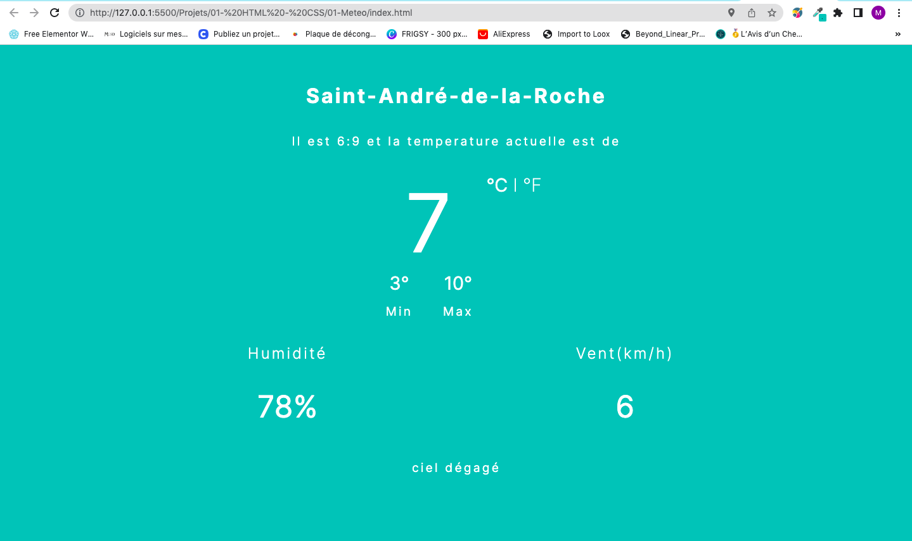

<!-- command Kv for live  -->


<!-- PROJECT SHIELDS -->
<!--
*** I'm using markdown "reference style" links for readability.
*** Reference links are enclosed in brackets [ ] instead of parentheses ( ).
*** See the bottom of this document for the declaration of the reference variables
*** for contributors-url, forks-url, etc. This is an optional, concise syntax you may use.
*** https://www.markdownguide.org/basic-syntax/#reference-style-links
-->


<!-- -->
<!-- HEADER -->
<br>
<header align="center">
   <br/> <br/>
  <h1 align="center">Projets Web</h1>
  <p align="center">
    Descripton pour tout les projet
  </p>
</header>


<!-- TABLE OF CONTENTS -->

  <summary>Table De Matière</summary>
  <ol>
    <li>
      <a href="#about-the-project">Présentations Des Projets</a>
      <ul>
        <li><a href="#built-with"> Weather App </a></li>
      </ul>
    </li>
    <li>
      <a href="#getting-started">Pour Commencer</a>
      </li>
    <li><a href="#contact">Contact</a></li>
    <li><a href="#acknowledgments">Remerciements</a></li>
  </ol>


<!-- ABOUT THE PROJECT -->
## Weather APP
 <br><div align="center"></div><br>


## Pour Commencer
Pour avoir ce projet veuillez effectué un git clone comme suit:
git clone

```sh
  git clone https://github.com/mohamed063197/Developpement-Web.git

  ```
Cette commande va effectué une copie sur votre repertoire local. Ensuite deplacez vous dans le dossier météo en effectuant la commande suivante:

```sh
  cd "Projets/01- HTML - CSS/01-Meteo"

  ```

## Language utilisés

- 
  
- 	

- 

<p align="right">(<a href="#readme-top">Retour en haut</a>)</p>

## Developement

Utilise un web service pour recuperer les données - **OpenWeatherMap API**  - 
Use Material Design 2
Dark Mode
Support two language. English & Persian
Use locale Database


<!-- CONTACT -->
## Contact

CHERIF MOHAMED - CherifMohamedAmineUnivFce@gmail.com

Lien Des Projets: [https://github.com/mohamed063197/Data-Scientist](https://github.com/mohamed063197/data-Scientist)

<p align="right">(<a href="#readme-top">Retour en haut</a>)</p>


